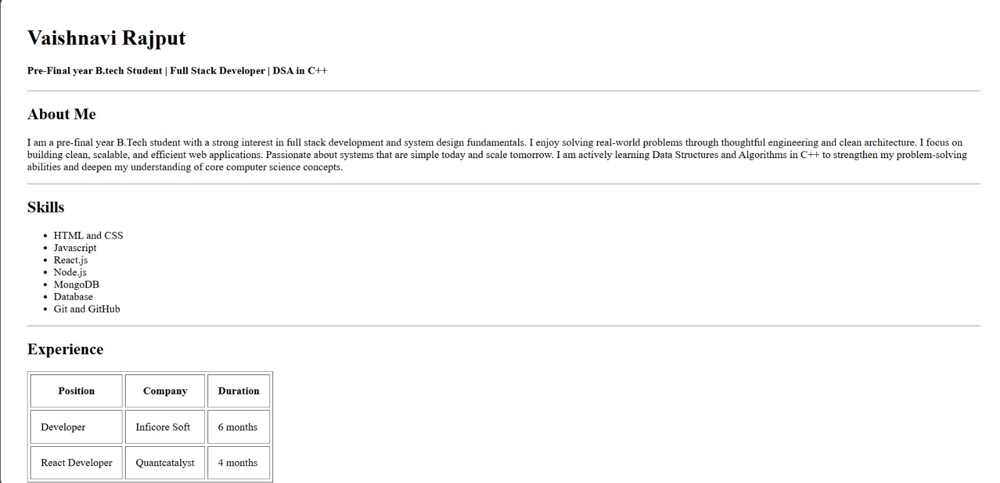

Resume Website (HTML) 

A clean and responsive single-page resume website built using pure HTML. This project showcases my academic background, skills, experience, projects, and contact details in a structured and readable format. 


Overview 

This resume website is designed to present my professional profile in a simple and elegant way.  
It focuses on semantic HTML structure, proper spacing, readability, and clean layout, making it suitable for academic submission as well as portfolio use. 

 

 Features 

- Single-page resume layout
- Semantic HTML tags (header, section, table, ul, etc.) 
- Skills displayed using lists
- Experience and Course displayed using tables 
- Clean spacing and alignment
- Easy to read and navigate
- Beginner-friendly and lightweight

 

Tech Stack

- HTML5
_ No frameworks or libraries used. 

 

Installation / Usage 

1. Clone the repository:
   ```bash
   https://github.com/Vaishnaviii002/Html-Resume

## 📸 Project Screenshot


